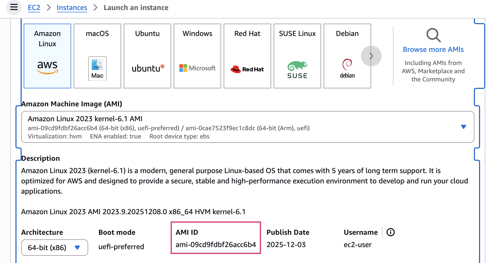

# Terraform EC2 Lab

This project uses Terraform to deploy an EC2 instance lab environment on AWS.

## Prerequisites

- Install [Terraform](https://www.terraform.io/downloads.html)
- Configure AWS credentials (using `aws configure` or environment variables)
- Ensure AWS CLI is installed and configured

## Usage

### 1. Format Code

```sh
terraform fmt
```

### 2. Initialize Project

```sh
terraform init
```

### 3. Plan Deployment

```sh
terraform plan
# If using a custom variables file
terraform plan -var-file="test.tfvars"
```

### 4. Apply Deployment

```sh
terraform apply
# If using a custom variables file
terraform apply -var-file="test.tfvars"
```

**Note**: During apply, Terraform will prompt for confirmation. Enter `yes` to proceed.

### 5. Check AWS Credentials

```sh
aws sts get-caller-identity
```

## Getting AMI ID

To get the appropriate AMI ID, follow these steps:

1. Log in to the AWS console.
2. Go to EC2 → Launch instance.
3. Select the operating system (e.g., Amazon Linux or Ubuntu).
4. Copy the AMI ID.
5. Paste it back into the Terraform variables.



## Variables

Refer to the `variables.tf` file for configurable variables.

## Outputs

Refer to the `outputs.tf` file for output information after deployment.

## Clean Up Resources

To destroy resources, run:

```sh
terraform destroy
# If using a custom variables file
terraform destroy -var-file="test.tfvars"
```

## Contributing

Feel free to submit Issues or Pull Requests.